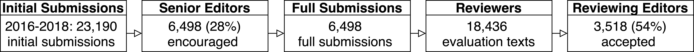

# How random is the review outcome? A systematic study of the impact of external factors on eLife peer review

[](https://github.com/Weixin-Liang/eLife-peer-review-random-external-factors-study/blob/master/LICENSE)

This is the code and data used to conduct the analysis for the paper titled "How random is the review outcome? A systematic study of the impact of external factors on eLife peer review". 

## Abstract
*The advance of science rests on a robust peer review process. However whether or not a paper is accepted can depend on random external factors--e.g. the timing of the submission, the assignment of editors and reviewers--that are beyond the quality of the work. This article systematically investigates the impact of such random factors independent of the paper’s quality on peer review outcomes in a major biomedical journal, eLife. We analyzed all of the submissions to eLife between 2012 to 2018, with 34,161 total submissions. We examined how random factors affect each decision step of the review process from the gate-keeping senior editors who may desk-reject papers to review editors and reviewers who recommend the final outcome. Our results showed that the peer-review process in eLife is robust overall and that random external factors have relatively little quantifiable bias.*

## Code availability
Our analysis code is publicly available at: 
https://github.com/Weixin-Liang/eLife-peer-review-random-external-factors-study.


## Usage
### Dependencies

Run the following commands to install the dependencies:
```bash

pip install pandas matplotlib tqdm
pip install scipy nltk bs4 
pip install fuzzywuzzy
<!-- conda install -c conda-forge fuzzywuzzy -->
pip install ethnicolr
<!-- conda install -c soodoku ethnicolr -->
```

### Data
Manuscripts submitted to eLife go through three stages: In the first stage, the manuscript is assessed by a senior editor, who may desk-reject or encourage the authors to provide a full submission. The majority, 72%, of initial submissions were desk-rejected. In the second stage, the full submission is reviewed by several reviewers. Each reviewer provides an evaluation text independently. In the third stage, the reviewing editors make the decision of acceptance. Though submissions might need to be revised multiple times in this stage, we focus on the final decision of the reviewing editors. 
<p align='center'>
  
</p>


Our eLife journal dataset was acquired by a data use agreement with the journal. All of the data’s analyses follow research guidelines for use of high-risk data on human subjects (University IRB protocol 12996). In full compliance with the signed protocol, data were stored in the Stanford Neuro Computing Platform, which is specifically designed for High-Risk Data. 


## Contact
Thank you for your interest in our work! Please contact me at wxliang@stanford.edu for any questions, comments, or suggestions! 
